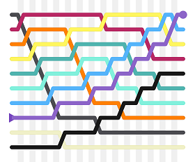
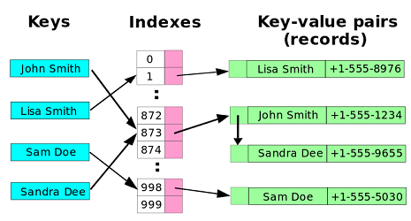
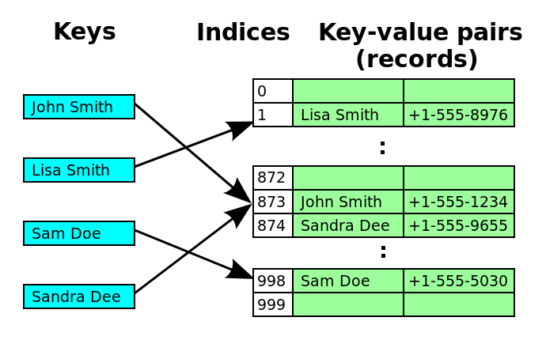

# Data Structures

## Table of Contents
  - [Sorts](##sorts)
    - [Bubble Sort](#bubble-sort)
    - [Insertion Sort](#insertion-sort)
    - [Selection Sort](#selection-sort)
    - [Merge Sort](#merge-sort)
    - [Quick Sort](#quick-sort)
  - [Stacks and Queues](#stacks-and-queues)
    - [Stack](#stack)
    - [Queue](#queue)
    - [Priority Queue](#priority-queue)
  - [Dictionary](#dictionary)
  - [Trees](#trees)
    - [Binary Tree](#binary-tree)
    - [Binary Search Tree](#binary-search-tree)
  - [Tree Traversal](#tree-traversal)
    - [Preorder](#preorder)
    - [Inorder](#inorder)
    - [Postorder](#postorder)
  - [Directed Graph Traversals](#directed-graph-traversals)
    - [Breadth-First](#breadth-first)
    - [Depth-First](#depth-first)
  - [List Searches](#list-searches)
    - [Linear](#linear)
    - [Binary](#binary)
  - [Math Algorithms](#math-algorithms)
    - [Euclidean Algorithm](#euclidean-algorithm)
    - [Sieve of Eratosthenes](#sieve-of-eratosthenes)

## Sorts

### Bubble Sort

[Bubble Sort](https://en.wikipedia.org/wiki/Bubble_sort) is a simple sorting algorithm which merely goes through an array, and for each item checks if it is out of order compared to the item after it. If the items are out of order, swap them. This process is repeated until the entire array is sorted. Bubble sort's only real boon is its simplicity, because it is far too inefficient to have any practical use cases.

#### Efficiency
Best Case: Ω(n)

Worst Case: O(n2)

Average Case: O(n2)

Space Complexity: O(1)

### Insertion Sort

[Insertion Sort](https://en.wikipedia.org/wiki/Insertion_sort) is another simple sorting algorithm, albeit more complex than Bubble Sort. Insertion Sort works by going through the array one element at a time, shifting that element back until it's in order compared to the elements behind it. This works because it effectively creates a growing sorted sub-array one element at a time as it goes through. Insertion Sort is a rather inefficient sort, which doesn't see much practical use. While better than Bubble Sort, it still has an average case of O(n2) which is very inefficient.

#### Efficiency
Best Case: Ω(n)

Worst Case: O(n2)

Average Case: O(n2)

Space Complexity: O(1)

### Selection Sort

### Merge Sort

### Quick Sort

---

## Stacks and Queues

### Stack

### Queue

### Priority Queue

---

## Dictionary

A [dictionary](https://en.wikibooks.org/wiki/Data_Structures/Hash_Tables) (also known as a map, hash map or hash table) is a structure which stores key-value pairs such that given a key, the map will return the corresponding value. This is done by *hashing* the key, which refers to using a function to reduce an object to a relatively small object of a consistent type. The hash functions used by a dictionary reduce objects to an integer so they can be used to access an index on the internal array, where each slot in the array is referred to as a *bucket*.

Sometimes, two different objects can produce the same key (since the hash value needs to have its range reduced to fit in the internal array). This is called a *collision*. There are two strategies commonly used to handle collisions:

### Chaining

The Chaining strategy for collisions is to make every bucket a linked list. When you get a collision, you just look through the list to see if the key already exists. For a set, if the key exists you change that pair's value, otherwise you append the new value to end of that bucket's list. For a get, you return the value of the key-value pair in the list if you find it, otherwise you return null/throw for not found/etc.

### Open Addressing

The Open Addressing strategy for collisions is to keep just a single key-value pair in each bucket, and on a collision search through other buckets until you find an open one. Once the internal array gets full, it gets re-instanced to a larger size then all the existing objects get re-inserted into the Dictionary.

---

## Trees

### Binary Tree

### Binary Search Tree

---

## Tree Traversal

### Preorder

### Inorder

### Postorder

---

## Directed Graph Traversals

### Breadth-First

### Depth-First

---

## List Searches

### Linear Search

### Binary Search

--

## Math Algorithms

### Euclidean Algorithm

### Sieve of Eratosthenes
